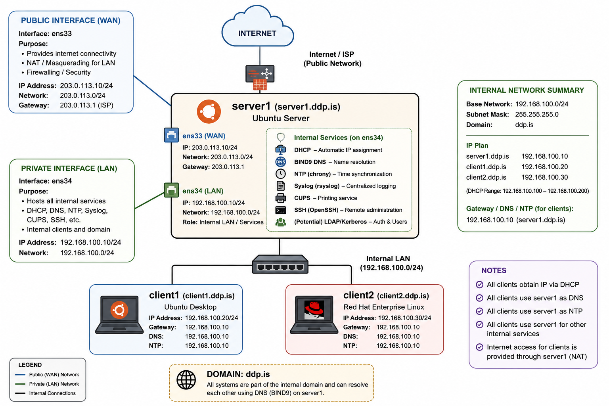

# DDP Linux Infrastructure Project



---

This project was created for the course **KEST3NL05EU – Linux Netstjórnun**.

The goal of the project is to build a small Linux infrastructure for a company called **DDP ehf.** using one central server and two Linux clients.

The infrastructure includes:
- DHCP server
- DNS server
- NTP time synchronization
- Centralized Syslog logging
- SSH hardening
- Postfix mail server
- Roundcube webmail
- CUPS printer sharing
- Automated backups
- Firewall hardening
- User automation scripts

---

## Important Notes

- `.txt` files are used for evidence/log outputs to improve GitHub readability and quick access to file contents.

---

# Network Overview

### Basic text overview of network structure:

```text
                           INTERNET
                               │
                        ens33 (NAT/WAN)
                               │
                            server1
                               │
                     ens34 (LAN/Internal)
                               │
              ┌────────────────┼────────────────┐
              │                                 │
       client1.ddp.is                   client2.ddp.is
       192.168.100.100                  192.168.100.101
```

### Table overview of the network structure:
| Device         | Role           | IP Address      |
| -------------- | -------------- | --------------- |
| server1.ddp.is | Main Server    | 192.168.100.10  |
| client1.ddp.is | Debian Client  | 192.168.100.100 |
| client2.ddp.is | Red Hat Client | 192.168.100.101 |

---

# Full Project Structure

```text
/DDP-Linux-Infrastructure-Project/
├── README.md
│
├── Config_Files/
│   ├── Client1_Ubuntu/
│   │   └── etc/
│   │       ├── chrony/
│   │       │   └── chrony.conf
│   │       ├── netplan/
│   │       │   └── 00-installer-config.yaml  ✅
│   │       ├── rsyslog.d/
│   │       │   └── 10-ddp-client.conf  ✅
│   │       ├── ssh/
│   │       │   └── ssh_config
│   │       ├── hostname  ✅
│   │       ├── hosts ✅
│   │       └── static_hosts  ✅
│   │
│   ├── Client2_CentOS/
│   │   └── etc/
│   │       ├── firewalld/
│   │       │   └── zones/
│   │       │       └── public.xml
│   │       ├── NetworkManager/
│   │       │   └── system-connections/
│   │       │       └── ens160.nmconnection ✅
│   │       ├── rsyslog.d/
│   │       │   └── 10-ddp-client.conf  ✅
│   │       ├── ssh/
│   │       │   └── sshd_config
│   │       ├── sysconfig/
│   │       │   └── network-scripts/
│   │       │       └── ifcfg-ens160 ✅
│   │       ├── chrony.conf
│   │       ├── hostname  ✅
│   │       ├── hosts ✅
│   │       └── static_hosts  ✅
│   │
│   └── Server1_Ubuntu/
│       └── etc/
│           ├── bind/
│           │   ├── db.192.168.100
│           │   ├── db.ddp.is
│           │   ├── named.conf.local
│           │   └── named.conf.options
│           ├── chrony/
│           │   └── chrony.conf
│           ├── cups/
│           │   └── cupsd.conf
│           ├── default/
│           │   └── isc-dhcp-server ✅
│           ├── dhcp/
│           │   └── dhcpd.conf  ✅
│           ├── dovecot/
│           │   └── conf.d/
│           │       └── 10-mail.conf
│           ├── netplan/
│           │   └── 00-installer-config.yaml  ✅
│           ├── postfix/
│           │   └── main.cf
│           ├── rsyslog.d/
│           │   └── 10-ddp-server.conf  ✅
│           ├── ssh/
│           │   └── sshd_config
│           ├── systemd/
│           │   └── journald.conf ✅
│           ├── ufw/
│           │   └── user.rules
│           ├── hostname  ✅
│           ├── hosts ✅
│           ├── static_hosts  ✅
│           └── sysctl.conf ✅
│
├── Documentation/
│   ├── Screenshots/
│   │   ├── Client1_Ubuntu/
│   │   │   ├── chrony.png
│   │   │   ├── dhcp.png  ✅
│   │   │   ├── dns_resolution.png  ✅
│   │   │   ├── final_validation.png
│   │   │   ├── static_hosts.png  ✅
│   │   │   ├── static_netplan_00-installer-config.png  ✅
│   │   │   ├── ssh_key_login.png
│   │   │   ├── static_network_validation.png ✅
│   │   │   └── syslog_test.png ✅
│   │   │
│   │   ├── Client2_CentOS/
│   │   │   ├── chrony.png
│   │   │   ├── dhcp.png  ✅
│   │   │   ├── dns_resolution.png  ✅
│   │   │   ├── final_validation.png
│   │   │   ├── static_hosts.png  ✅
│   │   │   ├── nmtui_static.png  ✅
│   │   │   ├── ssh_key_login.png
│   │   │   ├── static_network_validation.png ✅
│   │   │   └── syslog_test.png ✅
│   │   │
│   │   └── Server1_Ubuntu/
│   │       ├── backup_script_execution.png
│   │       ├── bind9_status.png  ✅
│   │       ├── chrony_status.png
│   │       ├── cron_schedule.png
│   │       ├── cups_status.png
│   │       ├── cups_web_interface.png
│   │       ├── dhcpd_config.png  ✅
│   │       ├── dhcp_leases.png ✅
│   │       ├── dhcp_server_status.png  ✅
│   │       ├── dig_forward_lookup.png  ✅
│   │       ├── dig_reverse_lookup.png  ✅
│   │       ├── dovecot_status.png
│   │       ├── final_validation.png
│   │       ├── static_hosts.png  ✅
│   │       ├── journald_persistent.png ✅
│   │       ├── static_netplan_00-installer-config.png  ✅
│   │       ├── postfix_status.png
│   │       ├── roundcube_login.png
│   │       ├── rsyslog_server_status.png ✅
│   │       ├── ssh_status.png
│   │       ├── static_network_validation.png ✅
│   │       ├── syslog_received.png           ✅
│   │       └── ufw_status.png
│   │
│   ├── Configuration_Guide.md
│   ├── Network_Infrastructure.png
│   ├── Network_Structure_Basic_Text_Diagram.md
│   ├── Project_Report.pdf
│   └── Ultimate_Final_Project_Guide.md
│
├── Evidence/
│   ├── dhcp/
│   │   ├── client1_lease.txt ✅
│   │   ├── client2_lease.txt ✅
│   │   ├── dhcp_status.txt ✅
│   │   └── dhcpd.leases  ✅
│   │
│   ├── dns/
│   │   ├── dig_forward_lookup.txt  ✅
│   │   ├── dig_reverse_lookup.txt  ✅
│   │   └── named_checkzone_output.txt  ✅
│   │
│   ├── firewall/
│   │   ├── firewalld_status.txt
│   │   ├── listening_ports.txt
│   │   └── ufw_status.txt
│   │
│   ├── logs/
│   │   ├── backup_log.txt
│   │   ├── journal_persistence_check.txt
│   │   └── syslog_test_results.txt
│   │
│   ├── nmap_scans/
│   │   ├── client1-basic-scan.txt
│   │   ├── client2-basic-scan.txt
│   │   ├── server1-basic-scan.txt
│   │   ├── server1-final-scan.txt
│   │   └── server1-udp-top20-scan.txt
│   │
│   ├── service_status/
│   │   ├── bind9_status.txt  ✅
│   │   ├── chrony_status.txt
│   │   ├── cups_status.txt
│   │   ├── dhcp_status.txt ✅
│   │   ├── dovecot_status.txt
│   │   ├── postfix_status.txt
│   │   ├── rsyslog_status.txt  ✅
│   │   └── ssh_status.txt
│   │
│   └── users/
│       ├── department_groups.txt
│       ├── home_directory_listing.txt
│       └── user_list_verification.txt
│
└── Scripts/
    ├── Testing/
    │   ├── test_backup.sh
    │   ├── test_mail.sh
    │   └── test_syslog.sh
    │
    ├── User_Creation_Logs/
    │   └── create_users.log
    │
    ├── backup_home.sh
    ├── create_users.sh
    ├── Linux_Users.CSV
    └── system_hardening.sh
```

---

# Technologies & Services Used

- Ubuntu Server
- Debian Linux
- Red Hat Linux
- Bash scripting
- ISC DHCP
- BIND9
- rsyslog
- Postfix
- Roundcube
- OpenSSH
- CUPS

---

# Author

Hreiðar Pétursson

